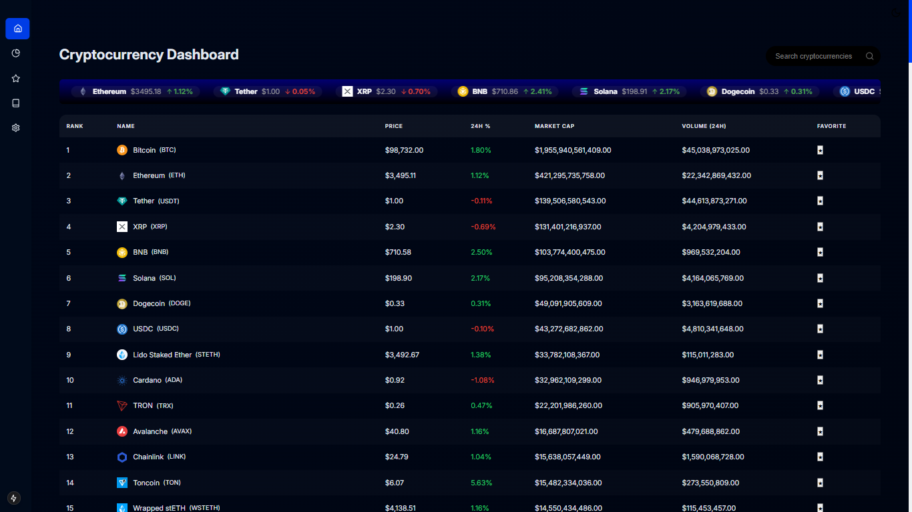
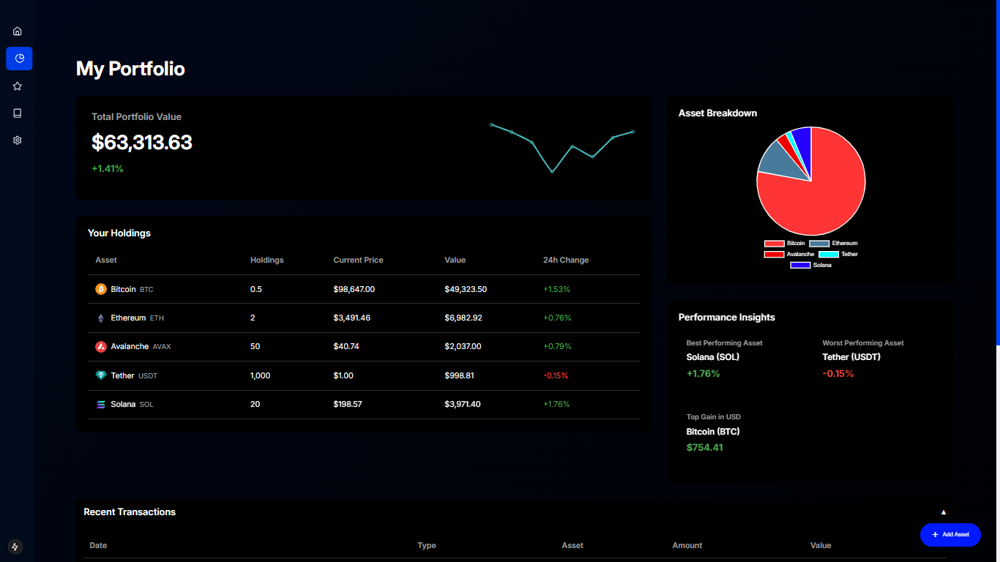

# CryptoTracker

**CryptoTracker** is a feature-rich cryptocurrency portfolio and analytics platform designed to provide real-time insights into the dynamic world of digital assets. This app offers a wide range of functionalities, from tracking real-time cryptocurrency prices to advanced analytics, news updates, and portfolio management.

### Portfolio Management Smart Contract Address (Deployed on Base Sepolia testnet): 0x42099C07116c6F5ff671d28F4c348ECc7F882Be4

## Features

### Real-Time Cryptocurrency Prices
- Track real-time price data for thousands of cryptocurrencies.
- View price changes and trends over 24 hours with percentage changes.

### Advanced Analytics
- Visualize data with charts and graphs for in-depth market analysis.
- Monitor historical data trends for smarter decision-making.

### Fear and Greed Index
- Gauge the market sentiment with the Fear and Greed Index.
- Make informed trading decisions based on the emotional state of the market.

### Currency Converter
- Instantly convert between fiat and cryptocurrency pairs.
- Support for multiple currencies.

### Crypto News
- Stay up-to-date with the latest news in the cryptocurrency space.
- Explore curated articles and insights from trusted sources.

### Portfolio Management
- Add, update, and remove assets from your portfolio.
- Calculate total portfolio value in real-time.
- Securely integrate blockchain for decentralized asset management.

---

## How It Works

1. **Add Assets to Your Portfolio**
   - Use the intuitive "Add Asset" button to search for cryptocurrencies and input the amount owned.
   - Portfolio values are calculated in real-time based on current market prices.

2. **Real-Time Data Fetching**
   - Cryptocurrency data is fetched via external APIs for price tracking, analytics, and news updates.

3. **Blockchain Integration**
   - Leverage a Solidity-based smart contract for secure and decentralized portfolio storage.
   - Assets added to the portfolio are linked to the user’s wallet address.

---

## Screenshots

